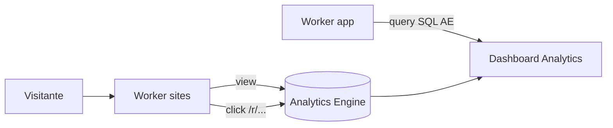

# Analytics

Paywall **Pro** (#2 depois do domínio). Free **não mede** — upgrade quando o dono pergunta “quantos clicaram?”.

Referência visual: dashboard Appsha (Profile Views, Click Rate, Top Links, gráfico semanal). Nós entregamos o **núcleo que retém** na F2; geo/device/fontes no **Business**.

## Appsha vs nosso escopo

| Widget Appsha | Nosso plano | Fase |
|---|---|---|
| Profile Views | Sim — GET página principal | F2 · **P** |
| Unique Views | Sim — cookieless hash/dia | F2 · **P** básico |
| Click Rate | Sim — cliques ÷ views | F2 · **P** |
| Clicks on Phone / WhatsApp | Sim — bloco Zap | F2 · **P** |
| Clicks on Email | Sim — se bloco e-mail | F2 · **P** |
| QR Share | Sim — `?src=qr` ou evento download QR | F2 · **P** |
| Gráfico temporal (7/30d) | Sim | F2 · **P** |
| Top Performing Links | Sim — tabela link × cliques | F2 · **P** |
| Traffic Sources | Referer agregado | F4 · **B** |
| Country (geo) | `CF-IPCountry` | F4 · **B** |
| Devices | UA parse mobile/desktop | F4 · **B** |
| CRM / Inbox | Não — fora analytics | — |



## Coleta (edge)

Tudo no **Worker `sites`**. SQL **não** grava pageview — só Analytics Engine (+ cache agregado opcional).

### Eventos

| `event_type` | Quando | Campos |
|---|---|---|
| `page_view` | GET `/` ou `/index.html` (HTML bio) | `tenant_id`, `path`, `referer`, `country`, `device` |
| `link_click` | GET `/r/{link_id}` → 302 | `tenant_id`, `link_id`, `block_type` |
| `whatsapp_click` | `/r/wa` ou link_id tipo wa | idem |
| `email_click` | bloco mailto / `/r/email` | idem |
| `qr_hit` | page_view com `?src=qr` | flag no view |

**Regras**

- Só tenant **Pro+** grava (`plan` no KV ou skip write).
- Bot/crawler: ignorar (`cf.bot_management` ou lista UA) — senão infla view.
- Não usar cookie no visitante.
- Unique view: `hash(ip + ua + date + tenant_id)` dedup no Worker (KV TTL 24h) **ou** contar só `page_view` distinto por dia no query AE.

### Links trackáveis

HTML publicado **não** aponta URL crua. Aponta:

```
https://{host}/r/{link_id}
```

Worker: write AE → 302 destino real. Paywall: free publica links diretos (sem analytics = incentivo upgrade).

### Page view sem JS

Opção A (recomendada v1): contar GET do documento HTML no Worker antes de servir R2.  
Opção B: pixel 1×1 — exige `` no template; pior para estático puro.

## Armazenamento

**Analytics Engine** — dataset `linknabio_events`.

Exemplo de ponto (API Workers):

```js
// env.ANALYTICS.writeDataPoint({
//   blobs: [tenant_id, event_type, link_id ?? ''],
//   doubles: [1],
//   indexes: [iso_date], // yyyy-mm-dd
// })
```

Consulta: **Analytics Engine SQL** no Worker `app` (autenticado, tenant scoping).

Agregados pesados (opcional): Cron diário grava snapshot em SQL `analytics_daily(tenant_id, date, views, clicks, …)` para dashboard rápido — só se query AE ficar lenta.

## Dashboard (app)

Rota sidebar **Analytics** (como Appsha). Layout F2:

```
┌─────────────────────────────────────────────────────────┐
│ Analytics                          [Last 7 days ▼]        │
├──────────────┬──────────────────────────────────────────┤
│ Profile Views│  [Gráfico linha — views ou click rate ▼]  │
│ Unique Views │                                          │
│ Click Rate   │                                          │
│ Clicks Zap   │                                          │
│ Top Links    │  Links          │ Clicks                 │
│              │  Meu site       │ 42                     │
│              │  Instagram      │ 31                     │
└──────────────┴──────────────────────────────────────────┘
```

**Métricas**

| Métrica | Fórmula |
|---|---|
| Profile Views | `count(page_view)` |
| Unique Views | dedup hash/dia ou AE `COUNT DISTINCT` |
| Click Rate | `link_clicks / profile_views` |
| Clicks WhatsApp | `count(link_click where block=wa)` |
| vs Last Week | mesma janela deslocada 7d; % delta |

Business (F4): + cards Traffic Sources, Country, Devices (3 colunas abaixo).

## Planos

| | Free | Pro | Business |
|---|---|---|---|
| Medir views/cliques | Não | Sim | Sim |
| Gráfico 7/30d | — | Sim | Sim |
| Top links | — | Sim | Sim |
| Export CSV | — | — | Sim (UC-65) |
| Geo / device / referer | — | — | Sim |

Copy upgrade free: *“Veja quem clica — Pro.”*

## Casos de uso

| UC | Nome |
|---|---|
| UC-61 | Ver dashboard analytics |
| UC-62 | Visitas agregadas |
| UC-63 | Registrar clique (edge `/r/`) |
| UC-64 | QR (URL `?src=qr` + contador) |
| UC-65 | Export CSV (Business) |

Detalhe: **[casos-de-uso.md](casos-de-uso.md)** § I.

## Fase de build

| Entrega | Fase |
|---|---|
| `/r/{id}` + AE write | **F2** |
| page_view no serve HTML | **F2** |
| API `/api/analytics?range=7d` | **F2** |
| UI dashboard cards + chart + top links | **F2** |
| Gate plano Pro | **F2** |
| Geo/device/referer + CSV | **F4** Business |

**Gate F2:** cliente Pro abre Analytics e vê cliques reais após tráfego.

## Privacidade (LGPD)

- Agregados only no dashboard; sem vender dados.
- IP não armazenado em claro — hash para unique ou só país CF.
- Política de privacidade na landing; bio não seta cookie de tracking.

## O que não fazer

- Gravar pageview no D1/KV por visita — custo e write storm.
- Analytics no free — mata paywall #2.
- Dashboard CRM-style (contatos por clique) — Business leads é outro módulo (UC-81).
- Google Analytics embutido como substituto — dependência externa; AE basta.

## Custo Cloudflare

Analytics Engine entra no Workers Paid; volume de bio pequeno fica marginal. Clique passa pelo Worker anyway (redirect).

Plano CF: **[cloudflare-plano-pago.md](cloudflare-plano-pago.md)**.
