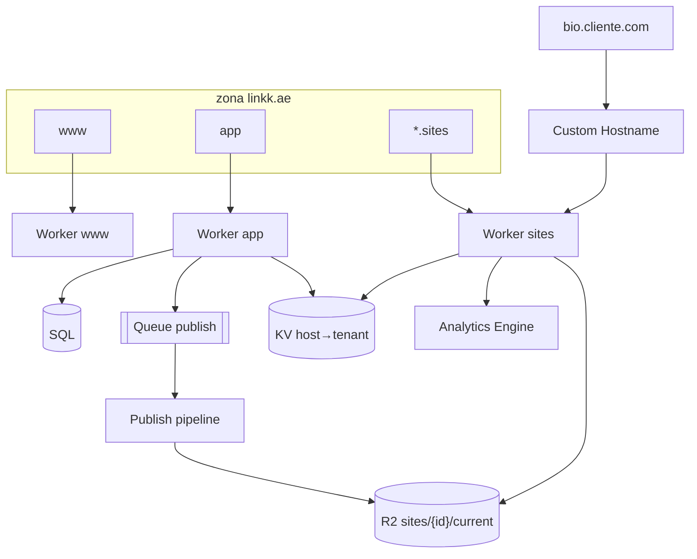
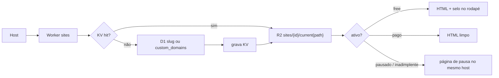
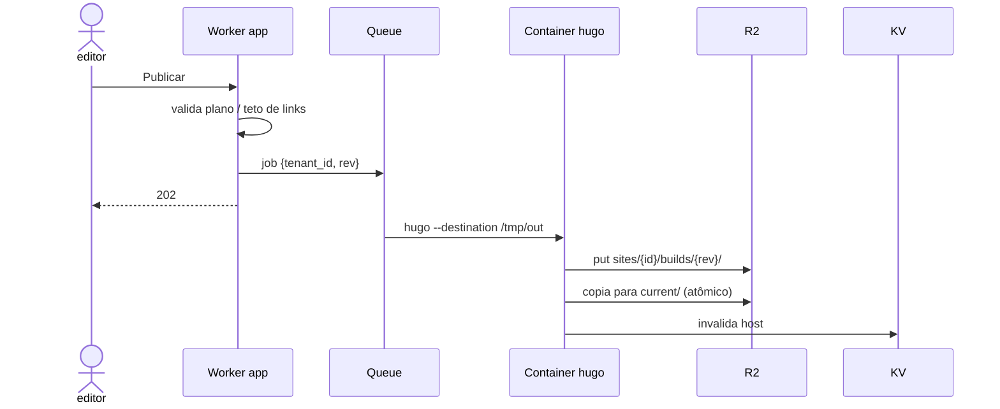
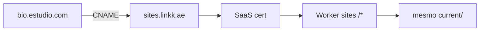

# Cloudflare como infra

**Contrato fixo:** Cloudflare na borda. **Contrato flexível:** SQL, linguagem do app e **pipeline de publicação** — trocáveis sem mudar o desenho abaixo.

Uma zona, três hosts, um bucket por tenant publicado. Tenant = registro no banco + prefixo no R2. Visitante → Worker `sites` lê `Host` → serve artefato publicado.

| Superfície | Host | Papel |
|---|---|---|
| Marketing | `www.linkk.ae` | Landing, pricing. Sem sessão. |
| App | `app.linkk.ae` | Dashboard, API, cobrança. Cookie só aqui. |
| Sites | `{slug}.sites.linkk.ae` | Página pública. Sem sessão. |
| Domínio pago | `bio.cliente.com` | Custom Hostname → mesmo Worker `sites`. |

Render pesado (SSG, templates, snapshot) roda **fora do request** — Queue + Worker ou Container. Botão Publicar responde 202.



## DNS

```
www     CNAME  www-worker
app     CNAME  app-worker
*       CNAME  sites-worker     ; só o subdomínio sites
sites   CNAME  sites-worker     ; fallback origin dummy A 192.0.2.0 se o origin for o Worker
```

Cookie `Domain=app.linkk.ae`. Nunca `.sites.linkk.ae`, nunca o apex.

## Request: sites



- Lookup por `Host`, nunca por path (`/maria` quebra CNAME).
- Selo do free: **no Worker**, não no HTML gravado. Upgrade some o rodapé sem rebuild.
- 90 dias sem publish/visita: Cron marca `paused`; o objeto no R2 fica. Não apague no dia.

## Publish



Tema = uma imagem pinada (`hugo:extended` + repo de temas). Não clone por cliente. Se o build falhar, `current/` não muda.

## Custom domain (pago, v2)

1. App cria Custom Hostname na API Cloudflare for SaaS.
2. Cliente aponta `bio.estudio.com` CNAME → `sites.linkk.ae`.
3. Certificado automático. Worker `sites` é o fallback origin (`*/*`).
4. Linha em `custom_domains.hostname` + KV.

Apex (`@`) fica depois. MVP aceita `bio.` ou `www`.



## App e dados

| Peça | Onde |
|---|---|
| Contas, tenants, assinaturas, page-model | SQL (D1, Postgres+Hyperdrive, …) |
| HTML/assets publicados | R2 `sites/{uuid}/` |
| Host → tenant | KV cache; SQL source of truth |
| Magic link | Worker + provedor e-mail |
| Checkout / status | PSP → webhook → SQL |
| Cliques (pago) | Analytics Engine |
| Pausa inatividade / billing | Cron Trigger |

Pipeline de publish: interface estável (`page_model` in → `sites/{id}/current/` out). Implementação v1 pode ser SSG, templates ou outro renderer.

Receita e planos: **[produto-e-receita.md](produto-e-receita.md)** · casos de uso: **[casos-de-uso.md](casos-de-uso.md)**.

## O que não entra na infra

- Workers for Platforms — cliente não executa código
- VPS/site por assinante
- Cookie de sessão no host público
- Tenant por path quando existir custom domain

## Corte por fase (não por horas)

Ver **[plano-construcao.md](plano-construcao.md)**. F1 = MRR + 1ª bio; F2 = domínio + analytics; F3 = free canal.

Workers Paid (US$ 5): **[cloudflare-plano-pago.md](cloudflare-plano-pago.md)** · Terraform: **[cloudflare-terraform.md](cloudflare-terraform.md)**.
