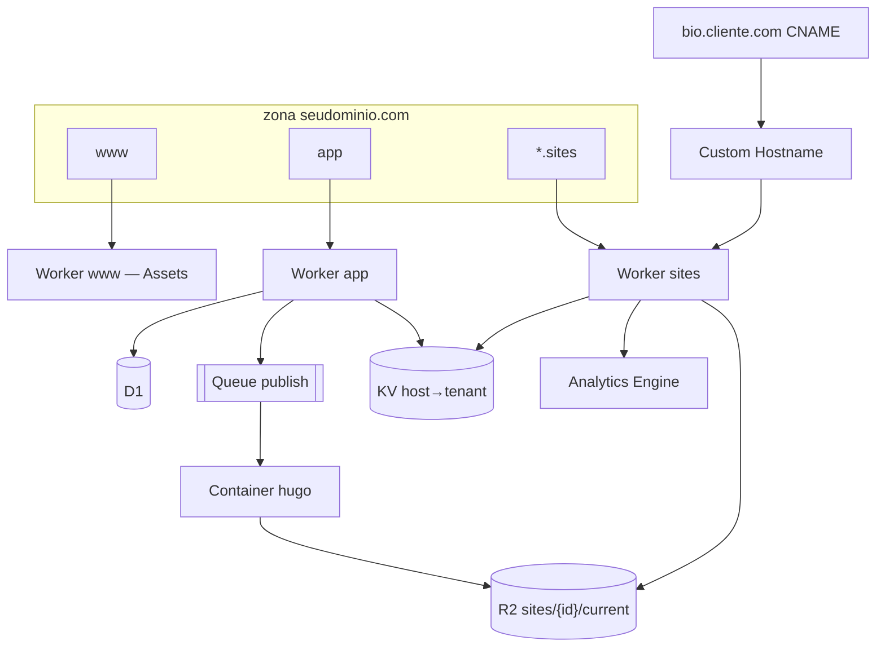
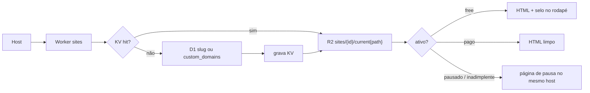
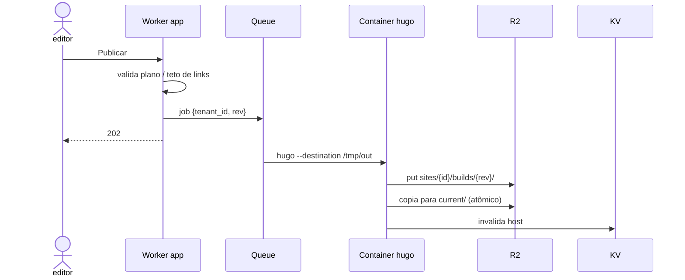
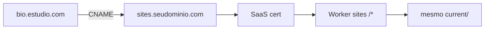

# Cloudflare como infra

Uma zona, três hosts, um bucket. Tenant = linha no D1 + prefixo no R2. O visitante cai num Worker que lê o `Host` e serve `current/`. Sem VPS, sem site Hostinger por cliente, sem Workers for Platforms (isso é para código do cliente; aqui o cliente não executa JS).

| Superfície | Host | Produto |
|---|---|---|
| Marketing | `www.seudominio.com` | Worker + Static Assets. Sem cookie. |
| App | `app.seudominio.com` | Worker (API + dashboard). Cookie só aqui. |
| Sites | `{slug}.sites.seudominio.com` | Worker origin → R2. Sem sessão. |
| Domínio pago | `bio.cliente.com` | Cloudflare for SaaS → o mesmo Worker de sites. |

Hugo não cabe no isolate. Roda num **Container** puxado por **Queue**. O botão Publicar não espera o binário.



## DNS

```
www     CNAME  www-worker
app     CNAME  app-worker
*       CNAME  sites-worker     ; só o subdomínio sites
sites   CNAME  sites-worker     ; fallback origin dummy A 192.0.2.0 se o origin for o Worker
```

Cookie `Domain=app.seudominio.com`. Nunca `.sites.seudominio.com`, nunca o apex.

## Request: sites



- Lookup por `Host`, nunca por path (`/maria` quebra CNAME).
- Selo do free: **no Worker**, não no HTML gravado. Upgrade some o rodapé sem rebuild.
- 90 dias sem publish/visita: Cron marca `paused`; o objeto no R2 fica. Não apague no dia.

## Publish



Tema = uma imagem pinada (`hugo:extended` + repo de temas). Não clone por cliente. Se o build falhar, `current/` não muda.

## Custom domain (pago, v2)

1. App cria Custom Hostname na API Cloudflare for SaaS.
2. Cliente aponta `bio.estudio.com` CNAME → `sites.seudominio.com`.
3. Certificado automático. Worker `sites` é o fallback origin (`*/*`).
4. Linha em `custom_domains.hostname` + KV.

Apex (`@`) fica depois. MVP aceita `bio.` ou `www`.



## App e dados

| Peça | Onde |
|---|---|
| `users`, `tenants`, `subscriptions`, `custom_domains` | D1 (`tenant_id` em toda linha) |
| HTML publicado | R2 `sites/{uuid}/` |
| Host → tenant | KV (TTL curto; D1 é source of truth) |
| Magic link | Worker + Resend/Postmark (Cloudflare não envia transacional) |
| Checkout | Stripe; webhook no Worker app |
| Clique (pago) | Analytics Engine no Worker sites |
| Pausa 90d / inadimplência | Cron Trigger |
| Bot | Turnstile no magic link |

Hyperdrive + Postgres só se D1 doer. Até lá, um D1.

Freemium no edge: teto de links e selo são regra do Worker app (gravação) e do Worker sites (resposta). Institucional não entra no free — o app recusa o `kind`.

## O que não entra

- Workers for Platforms / dispatch por tenant — cliente não sobe código.
- Pages **por** assinante — um origin, N prefixos no R2.
- Cloudflare Pages para sites (plataforma em recuo; Worker + R2 resolve Host).
- 1 Container por cliente — um pool Hugo, fila única.
- Cookie no host público.
- Path-based tenant (`/maria`).

## Corte MVP (6–10 h/semana)

1. Zona + três hosts + Worker sites + R2 + D1 + KV.
2. Worker app: Stripe webhook → tenant → magic link → onboard → enqueue.
3. Container Hugo + Queue.
4. Selo e pausa no Worker sites.
5. Custom Hostname quando o 1º pago pedir domínio.

Custo de HTML estático no R2 + Worker é o que deixa o free auto-pausável e sem atendimento. O Container só gira no publish.

Workers Paid (US$ 5) cabe neste desenho: **[cloudflare-plano-pago.md](cloudflare-plano-pago.md)**.
