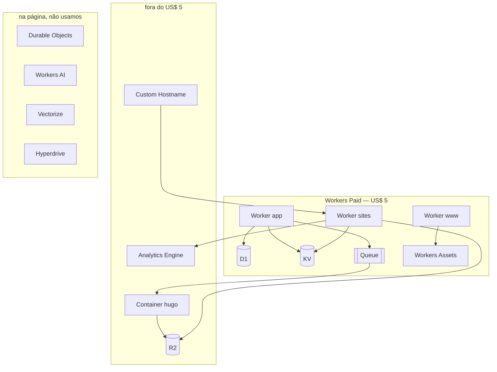
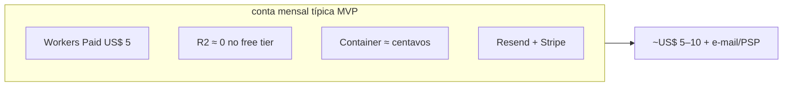

# Workers Paid (US$ 5) × o diagrama

**Sim, atende.** O plano é o teto do isolate (Worker, D1, KV, Queue, Assets). R2, Container Hugo e Custom Hostname **não** estão nessa tela — entram à parte, baratos neste produto.

Escala que a cota segura: dezenas de milhares de bios, milhões de visitas/mês. O free auto-pausável (90 dias) existe justamente para o HTML zumbi não virar fatura.

## Veredito por cota

| Cota na tela | Cabe? | Por quê neste produto |
|---|---|---|
| 10 M requests Worker | Sim | Bio é HTML + poucos assets. ~2–4 req/visita. 10 M req ≈ 2,5–5 M visitas/mês. |
| 30 s CPU / request | Sim | Serve arquivo. CPU real é ms, não segundos. Os 30 s são teto, não consumo. |
| 30 M ms CPU/mês | Sim | I/O (R2/KV) não conta como CPU. Injetar selo no rodapé é barato. |
| D1 25 Bi rows read / 50 M write / 5 GB | Sim | Banco pequeno: users, tenants, assinatura, page-model. Visita **não** grava D1. |
| KV 10 M reads / 1 M writes / 1 GB | Sim | 1 read por visita (Host→tenant). Write só no publish/onboard/pausa. |
| Queue 1 M mensagens | Sim | 1 job por Publicar. Não por visita. |
| Assets | Sim | Landing `www`. |
| Builds 6 slots / 6 000 min | Sim | CI **do nosso** código, não o Hugo do cliente. |
| Durable Objects / AI / Vectorize | Não usar | Não há estado realtime, LLM nem busca vetorial. |

Fora da tela, ainda neste desenho:

| Peça | Custo típico MVP | Nota |
|---|---|---|
| R2 | free tier (10 GB + 10 M reads) | HTML de bio é KB. Sem egress. |
| Container Hugo | centavos a poucos US$ | Só no publish, CPU ativa. |
| Custom Hostname | 100 hostnames inclusos na zona; +US$ 0,10/host | Só no pago, v2. |
| Analytics Engine | uso | Só clique do plano pago. |
| E-mail (Resend) | fora da Cloudflare | Magic link. |

## Cada nó

### Worker www + Workers Assets

Páginas estáticas da landing e cards de preço. **Assets** é o “host de arquivo” colado no Worker: HTML/CSS/JS da marketing, cache na edge, **sem cookie**.

Por que não Pages: Cloudflare empurra Worker+Assets; um Worker `www` isola a superfície de marketing das outras duas.

Cota: requests + Assets. Volume de `www` é irrelevante ao lado de `sites`.

### Worker app

API + dashboard. Único host com cookie (`Domain=app.linkk.ae`). Aqui: magic link, onboard, Stripe webhook, enqueue do publish, teto de links do free.

Não serve a bio pública. Não mistura com `sites`.

Cota: requests. Editores são milhares; visitantes são milhões. O app quase não fura os 10 M.

### Worker sites

Origin de `{slug}.sites…` e, no v2, de `bio.cliente.com`. Lê `Host` → KV → R2 `current/` → devolve HTML. Injeta selo do free, página de pausa, recusa cookie de login.

É o nó que come a cota de **requests** e de **KV reads**. Continua barato: lookup + GET no R2, sem Hugo no request.

### D1

SQL serverless (SQLite gerenciado pela Cloudflare), acessível do Worker por binding — sem VPC, sem connection pool.

**Por que:** o tenant é relacional (`users`, `tenants`, `subscriptions`, `custom_domains`, page-model). Precisa de transação no webhook do Stripe (user + tenant + assinatura) e de unique no slug. KV não faz isso.

**O que NÃO vai no D1:** HTML publicado (R2), Host quente (KV), clique (Analytics Engine). D1 é source of truth; a visita não escreve nele.

5 GB / 50 M writes: 10 k tenants com page-model de dezenas de KB cabem em centenas de MB. Writes = save/publish/webhook, não pageview.

Hyperdrive (Postgres acelerado) só se D1 doer. Não começa nisso.

### KV

Key-value global, leitura em ms, **eventual consistent**. Não é banco.

**Por que:** o hot path é `Host → tenant_id + status + prefixo R2`. Sem KV, cada visita faria SQL. Com KV, D1 só no miss (publish, CNAME novo, pausa).

Chave: hostname. Valor: `{tenant_id, plan, paused, prefix}`. TTL curto + invalidate no publish.

1 M writes/mês sobra: write só quando o mapa muda. 10 M reads = teto alinhado aos 10 M de requests. **Não** gravar sessão nem analytics no KV (write custa caro no overage).

### Queue

Fila: o Worker app solta `{tenant_id, rev}` e responde **202**. Um consumer puxa e chama o Container.

**Por que:** a nota de produto exige que Publicar não espere o `hugo`. Isola o botão do binário. Retry se o build falhar; `current/` não mexe.

1 M msgs: milhares de publishes/mês. Visita **não** enfileira.

### Container hugo

Linux com `hugo:extended` + temas pinados. **Não** está no card de US$ 5. Workers isolate não roda binário Go.

**Por que:** o produto publica HTML Hugo e o pago exporta zip. Um pool, uma fila — não um container por cliente.

Gira segundos por job. Custo = CPU ativa, não 24/7.

### R2

Object storage (S3-compatible) **sem taxa de egress**. Também fora do card de US$ 5; tem free tier próprio (10 GB + 10 M reads).

**Por que:** o site público é arquivo, não linha de banco. Prefixo `sites/{uuid}/current/` + `builds/{rev}/`. Troca atômica do `current` depois do build OK.

Bio ≈ HTML + foto + CSS. 10 k sites cabem nos 10 GB. Read da visita = Class B (o free tier cobre 10 M, o mesmo teto do Worker).

### Custom Hostname (Cloudflare for SaaS)

Certificado e roteamento para `bio.cliente.com` → o Worker `sites`. Fora do Workers Paid; 100 hostnames inclusos na zona, depois US$ 0,10/mês cada.

**Por que:** CNAME do cliente precisa de TLS no hostname **dele**. Não é site extra, não é VPS. Só plano pago, v2.

### Analytics Engine

Série temporal barata no Worker. Fora do screenshot.

**Por que:** o paywall “quer saber o clique” não pode ir para D1 (estoura write) nem KV. Só no pago; free não mede.

## O que a página lista e este produto ignora

| Item | O que é | Por que não |
|---|---|---|
| Durable Objects | Objeto com estado forte e coordenação | Sem collab realtime, sem lock por tenant no request. Fila + R2 atômico bastam. |
| Workers AI | Inferência de modelo na edge | Editor não é chat. |
| Vectorize | Índice de embeddings | Sem busca semântica. |
| Hyperdrive | Acelera Postgres/MySQL externo | D1 resolve o MVP. |
| Workers Logs | Log de invocação, 7 dias | Observabilidade, não arquitetura. Liga no debug. |
| Workers Builds | Minutos de CI | Deploy **nosso** (`www`/`app`/`sites`). O Hugo do cliente é o Container. |

## Corte de custo honesto

Estoura o US$ 5 só com: visita na casa dos milhões **sem** cache, write de analytics no D1/KV, ou Hugo no request (proibido). O desenho já evita os três: KV no Host, Analytics Engine no clique pago, Container só na fila.
