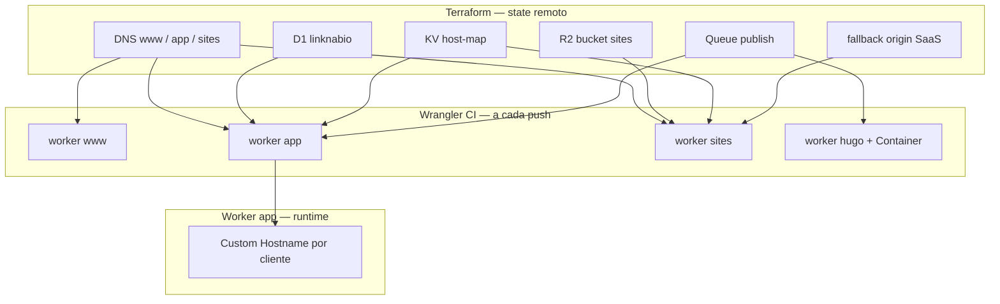
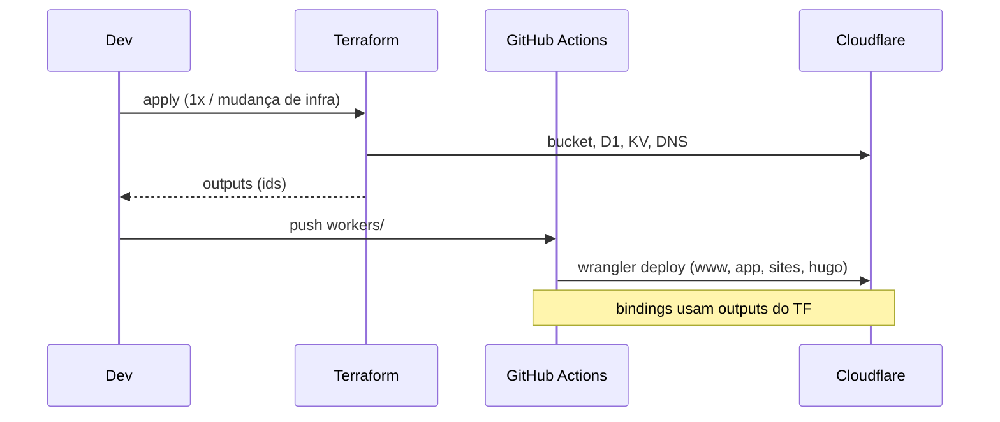

# Terraform

Terraform cuida da **plataforma fixa** (DNS, R2, D1, KV, Queue, fallback SaaS). O **código** dos Workers e o Container Hugo saem pelo **Wrangler** no CI — senão o state incha e cada `git push` vira `terraform apply`.



## Quem faz o quê

| Recurso | Terraform | Wrangler / app | Por quê |
|---|---|---|---|
| Zona + DNS (`www`, `app`, `*.sites`) | Sim | — | Infra rara; drift manual dói |
| R2 bucket `linknabio-sites` | Sim | — | Um bucket, N prefixos |
| D1 `linknabio` | Sim | migrations via `wrangler d1` | DB existe antes do 1º deploy |
| KV `host-map` | Sim | — | Namespace fixo |
| Queue `publish` | Sim | consumer no `wrangler.toml` do hugo | Fila é contrato entre app e hugo |
| Fallback origin SaaS | Sim | — | Pré-requisito do Custom Hostname |
| Worker shells + custom domains | Opcional | **Sim** (recomendado) | Deploy diário; TF versiona JS no state |
| Bindings (R2/D1/KV/Queue) | IDs no output TF | Referência no `wrangler.toml` | Um lugar para IDs, outro para código |
| Cron 90d inatividade | — | `wrangler.toml` do app | Trigger é config do script |
| Custom Hostname **por cliente** | **Não** | API no Worker app | Dinâmico; 100+ hostnames |
| HTML do tenant no R2 | **Não** | Container Hugo | Conteúdo, não infra |
| Stripe / Resend secrets | TF var ou CF dashboard | `wrangler secret put` | Nunca commitar |

## Layout

```
infra/terraform/
├── README.md
├── versions.tf
├── variables.tf
├── main.tf
├── outputs.tf          # IDs para wrangler.toml
├── terraform.tfvars.example
└── modules/
    ├── platform/       # R2, D1, KV, Queue
    ├── dns/            # www, app, sites, fallback A
    └── saas/           # fallback origin (v2)
```

## Fluxo de deploy



Ordem na 1ª vez:

1. `terraform apply` → cria plataforma
2. `wrangler d1 migrations apply` → schema
3. `wrangler deploy` nos quatro workers
4. Custom Hostname de cliente só quando o app chamar a API (v2)

## State

Backend remoto desde o dia 1 (`cloudflare` R2 ou Terraform Cloud free). State local some com o laptop.

Token de API com escopo mínimo:

- Account: Workers Scripts, R2, D1, KV, Queues
- Zone: DNS Read/Edit, SSL Read/Edit (fallback SaaS)

## O que **não** colocar no Terraform

- `cloudflare_custom_hostname` **por tenant** — o app cria quando o pago conecta domínio
- Objetos R2 `sites/{uuid}/` — runtime do Hugo
- Entradas KV `maria.sites…` — runtime do onboard/publish
- Linhas D1 de tenant — dados de app

Terraform = **contrato da plataforma**. App = **dados e domínios de cliente**.

## Provider

Provider oficial `cloudflare/cloudflare` **~> 5.19** (Workers v2: `cloudflare_worker` + `cloudflare_worker_version`). Evite `cloudflare_workers_script` legado para projeto novo.

Esqueleto executável: **[../infra/terraform/README.md](../infra/terraform/README.md)**.
