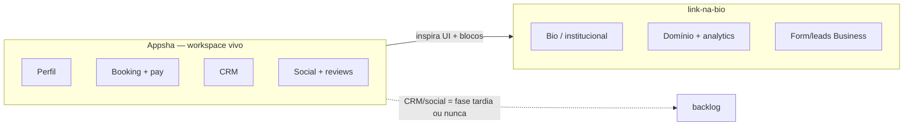
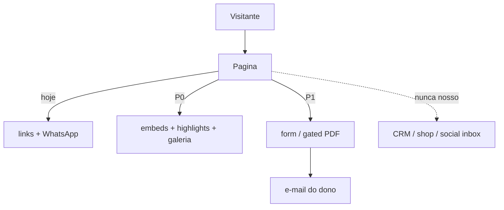

# Concorrente: Appsha (appsha.com)

Appsha se vende como **smart profile** para coaches, consultores, freelancers e PME: não é só “link na bio”. É perfil + captura + booking + pagamentos + CRM + reviews + social inbox. O vídeo fala “Appshure/Appure”; o produto é **Appsha**.

Nosso produto: **presença profissional + assinatura recorrente**. Benchmark de features e UI: **[concorrente-appsha.md](concorrente-appsha.md)**, **[design-appsha.md](design-appsha.md)**. Prioridade = o que sobe MRR ([produto-e-receita.md](produto-e-receita.md)).

## O que o Appsha faz (esmiuçado)

### 1. Perfil / página pública

| Feature | Detalhe |
|---|---|
| Multi-perfil | Vários perfis sob **uma conta**, cada um com `appsha.com/username` e branding próprio |
| Temas | 6+ temas; premium no Pro |
| Links | Lista de links; scheduling e expiração |
| Embeds | YouTube, Vimeo, HTML livre **na página** (sem redirecionar) |
| Galeria | Grid / scroll / carrossel; fotos no perfil |
| Highlights | Badges no topo (horário, “pet friendly”, certificação, women-owned…) |
| Attachments | PDF/docs; free, gated (e-mail/fone) ou pago |
| QR code | Um link + QR (vídeo) |
| SEO | URL custom, metadata, discoverability (Pro) |

### 2. Conversão na página (“designed for action”)

| Feature | Detalhe |
|---|---|
| Forms | Contato / inquiry → vira lead |
| Booking | Disponibilidade do **Google Calendar**; confirmação + lembrete |
| Paid sessions | Agenda + cobrança na hora |
| Events | Ingressos / registro |
| Shop nativo | Produto físico/digital com checkout **dentro** do perfil (Pro+) |
| Shop externo / affiliate | Cards que apontam pra loja/afiliado |
| Downloads pagos | Upload → preço → entrega automática pós-checkout |
| Conteúdo agendado | Bloco sobe/some por data (lançamento, oferta sazonal) |

### 3. CRM embutido (pós-clique)

| Feature | Detalhe |
|---|---|
| Auto-contato | Toda interação (form, booking, buy, download) cria contato |
| Timeline | Histórico por contato |
| Notes / tasks / reminders | Follow-up sem CRM “enterprise” |
| Deals / pipeline | Leads e pedidos de serviço |
| Segmentação | Filtro por atividade / fonte |
| E-mail do dashboard | Envio e histórico colados no contato (Pro+) |

### 4. Reviews e reputação (Pro+)

- Pedir review Google (1 clique + reminder em 3 dias)
- Inbox unificado Google / Facebook / Instagram
- Reviews no perfil (prova social)
- Distribuição de rating / tendência

### 5. Social media management

- Publicar / agendar FB + IG (posts, stories, reels)
- Caption com AI
- Inbox de DMs + comments
- Calendário editorial
- Atividade social ligada ao CRM

### 6. Times e agências

- Membros no perfil (Pro: +2, Pro+: +5)
- Roles / permissões
- Multi-perfil pra agência (clientes separados)
- Analytics agregado

### 7. Monetização e pricing (produto)

| Plano | Posição |
|---|---|
| **Starter (free)** | Perfil, embeds, highlights, shop **externo**, booking (calendário), forms → CRM básico, analytics básico + trial Pro 14d |
| **Pro** | Temas premium, CRM completo, anexos, schedule/expire, analytics avançado, SEO, 2 seats |
| **Pro+** | Shop nativo, booking pago, e-mail, reviews, early access, 5 seats |

Claim: cobrança só da assinatura — **sem cut** da receita do cliente. Free forever, sem cartão.

### 8. Posicionamento (vídeo + site)

Problema: “tudo online, links demais, troca de app demais”.  
Promessa: **uma identidade digital** → compartilhar → CRM → analytics → time.  
ICP: negócios **baseados em relacionamento** (agenda, inquiry, review), não creator de linkwall puro.

## O que já cobrimos (ou quase)

| Appsha | Nosso plano |
|---|---|
| Perfil com links + temas | Bio + skins / starters |
| Analytics de clique | Paywall do pago |
| Domínio / URL própria | CNAME (pago) — nosso paywall #1 |
| Multi-perfil | “1 site no começo; 2 sites depois” |
| SEO / canonical | Doc de tenants |
| Free + upgrade | Freemium com selo |

## O que **não** adicionar no v1 (F1–F3)

CRM completo, booking nativo, shop nativo, social suite, reviews sync — **atrasam MRR**. Form→e-mail no Business (F5) cobre parte do job.

## O que **adicionar** (prioridade receita)

Ver **[casos-de-uso.md](casos-de-uso.md)** e fases em **[plano-construcao.md](plano-construcao.md)**. Resumo:

### P0 — MVP / primeiro pago (vale o ticket)

1. **QR code do site** — gerar PNG/SVG no app a partir da URL canônica. MEI imprime no balcão. Zero no HTML; é feature do dashboard.
2. **CTA WhatsApp first-class** — bloco/botão com `wa.me` + mensagem pré-pronta. No BR bate booking do Appsha sem Calendar.
3. **Embeds** — YouTube / Spotify / Vimeo / Google Maps como blocos do page-model (iframe estático no Hugo).
4. **Highlights / chips** — 3–6 badges no topo (ex.: “Orçamento no Zap”, “Atendo online”, horário). Barato, diferencial visual vs Linktree genérico.
5. **Galeria** — 1 bloco grid/carrossel (institucional e portfólio; bio pago). Fotos no R2 no publish.

### P1 — paywalls honestos (depois do domínio/analytics)

6. **Agendar / expirar bloco** — `starts_at` / `ends_at` no page-model; Hugo ou Worker `sites` esconde. Oferta “só até sexta” sem CRM.
7. **Formulário → e-mail/Zap** — form estático posta num Worker endpoint → Resend/webhook; **não** CRM. Lead vai pro e-mail do dono. Só no pago.
8. **Download gated** — PDF no R2; libera após e-mail (Worker). Portfólio/MEI (cardápio, tabela de preço). Só institucional/pago.
9. **Cards de afiliado / loja externa** — bloco “produto” com imagem + preço + URL (Hotmart, Shopify, Mercado Livre). Sem checkout nosso.
10. **Skins premium** — mais temas no pago (Appsha usa isso no Pro).

### P2 — expansão de conta (quando o core converter)

11. **2º perfil / site** — mesmo `user`, outro `tenant` (já previsto). Agência light sem seats.
12. **Bloco Calendly / Google Appointment** — **só embed/link**, não sync nativo. Quem precisa de agenda usa a ferramenta deles.
13. **SEO pack pago** — title/description/OG por página + preview no dashboard (além do canonical).

## Ajuste de posicionamento (nosso vs deles)

| | Appsha | Nós |
|---|---|---|
| Job | Atenção → booking → relacionamento | Atenção → ação clara (Zap/link) → página profissional |
| Runtime | App dinâmico + integrações | HTML Hugo + edge |
| Free | Forever + booking + CRM raso | Bio fina + selo + pausa 90d |
| Upgrade | CRM, shop, reviews, seats | Domínio, sem selo, analytics, export, embeds/galeria |
| Não prometemos | “Seu CRM e sua rede social” | “Sua bio/site no ar, seu domínio, seu zip Hugo” |

## Checklist pra atualizar o roadmap

- [ ] QR no dashboard (P0)
- [ ] Bloco WhatsApp com mensagem (P0)
- [ ] Blocos embed YT/Spotify/Maps (P0)
- [ ] Highlights no page-model (P0)
- [ ] Galeria + upload R2 no publish (P0)
- [ ] `starts_at` / `ends_at` em blocos (P1)
- [ ] Form → Worker → e-mail (P1, pago)
- [ ] Download gated (P1, pago / institucional)
- [ ] Card afiliado / loja externa (P1)
- [ ] 2º site na mesma conta (P2)
- [ ] Embed Calendly only (P2)
- [ ] Explicitamente **fora**: CRM, booking nativo, shop nativo, social suite, reviews sync

## Fontes

- [appsha.com](https://appsha.com/)
- [Pricing](https://appsha.com/pricing/)
- [Designed for action](https://appsha.com/designed-for-action/)
- [Lead capture](https://appsha.com/lead-capture/)
- [CRM / follow-up](https://appsha.com/contact-and-follow-up/)
- [Reviews](https://appsha.com/reviews-and-reputation/)
- [Social](https://appsha.com/social-media-management/)
- [Agencies](https://appsha.com/agencies-teams-organization/)
- Transcrição do vídeo de apresentação (multi-perfil, CRM, analytics, team, QR)

UI / design das telas: **[design-appsha.md](design-appsha.md)**.
