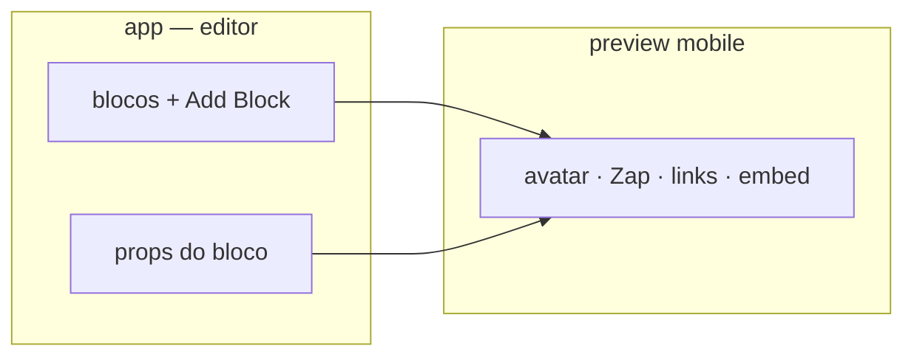

# Design Appsha (UI)

O MP4 local (`Desktop\Jorge William\Gravando…`) **não está montado** neste ambiente. Análise feita nas telas **ao vivo** de [appsha.com](https://appsha.com/) + capturas em `/opt/cursor/artifacts/screenshots/` (sessão do agent). Se o vídeo tiver telas de dashboard autenticado, anexe o arquivo no chat para complementar.

## Linguagem visual

| Peça | Como é |
|---|---|
| Primária | Azul cobalto forte (~`#0038FF`) — CTA, logo, ênfase no H1 |
| Fundo | Branco + cinza muito claro; seções escuras roxo/índigo em feature |
| Tipo | Sans limpa (Inter-like); H1 grande; palavra-chave em azul |
| Forma | Cantos 8–12px, cards com sombra leve, pills de feature |
| Tom | SaaS “limpo”, muito whitespace, mockup de iPhone no hero |

Logo: círculo com α em gradiente azul→vermelho/laranja + “appsha” minúsculo.

## Landing

- Faixa topo (anúncio) + nav Features/Pricing + **Create your profile** azul
- Hero 2 colunas: copy à esquerda, foto de contexto + **telefone** com perfil real à direita
- Badge: “Free to start — No credit card”
- 2 CTAs: sólido azul + outline “View demo”
- Carousel de personas (fotógrafo, coach, café…)
- Faixa “BUILT FOR” (Consultants, Freelancers, Agencies…)
- Tabs **Share / Connect / Engage** nas seções de produto

## Perfil público (o que o visitante vê)

Ordem típica no mockup mobile:

```
avatar circular
nome + @handle
ícones sociais coloridos (IG, YT, …)
CTA duplo (Connect | Email) — botões cheios
links em cards (“My Website”, “My Portfolio”)
embed de vídeo
(opcional) booking / tip / shop
```

- Mobile-first, scroll vertical, blocos empilhados
- Ícones de rede **coloridos** (não monocromáticos)
- Um CTA principal perto do topo (Book / Email / Connect)

## Editor (pelo mockup da landing)

```
┌─────────────┬──────────────┐
│ Nome/user   │              │
│ Social links│  Preview     │
│ Store toggle│  iPhone      │
│ Bio         │  ao vivo     │
│ lista blocos│              │
│ + Add Block │  +12 clicks  │
└─────────────┴──────────────┘
```

- Builder por **blocos** + botão azul **+ Add Block**
- Preview telefone ao lado (ou flutuando)
- Cards flutuantes de analytics (“+12 clicks today”) e integrações — marketing; no app real o CRM/social pesa mais

## Signup (`app.appsha.com/register`)

- Split: form à esquerda (Username, Email, Password, Google) / painel azul à direita (“Clicks Into Connections”)
- **Username no signup** = slug público cedo (eles vendem `appsha.com/user`)

## Pricing (UI)

3 cards: Starter free (outline) · Pro **RECOMMENDED** (CTA azul) · Pro+ (outline). Sem preço na dobra — “Get Started”. Free forever + trial Pro 14d.

## O que **roubar** pro nosso UI (sem virar CRM)

| Padrão Appsha | No nosso produto |
|---|---|
| Preview iPhone ao lado do editor | Dashboard: editar page-model \| preview `sites` |
| `+ Add Block` | Mesmo verbo; blocos = links, Zap, embed, highlight, galeria |
| CTA duplo no topo do perfil | **WhatsApp** (primário BR) + 2º (e-mail / site) |
| Ícones sociais coloridos | Na bio free/paga |
| Pills de feature na landing | Tags: Links, Embeds, Galeria, Highlights, Temas |
| Hero com foto real + phone | Landing `www`: MEI/consultório + mockup da bio |
| Badge “sem cartão” / free | Só se mantivermos freemium; senão “a partir de R$ X” |
| Card Pro com selo RECOMMENDED | Nosso card pago destacado |
| Username cedo | Já no onboard (slug) — manter |

## O que **não** copiar no design do app

- Sidebar inchada de CRM / deals / inbox social
- Toggle “Store” e booking calendar no editor do MVP
- Tip jar / tip no perfil
- Painel de integrações tipo “app store” no dia 1
- Signup com **senha** — nosso fluxo é magic link (+ PSP no pago)

## Wire mínimo do nosso editor (inspirado, não clone)



Publicar continua fila Hugo → R2; o preview pode ser iframe do `sites` ou draft HTML leve — não precisa do CRM deles.

## Capturas (sessão)

`/opt/cursor/artifacts/screenshots/01`…`14-appsha-*.webp` — hero, blocos, pricing, signup, booking, lead/CRM.

Features/produto: **[concorrente-appsha.md](concorrente-appsha.md)**.
