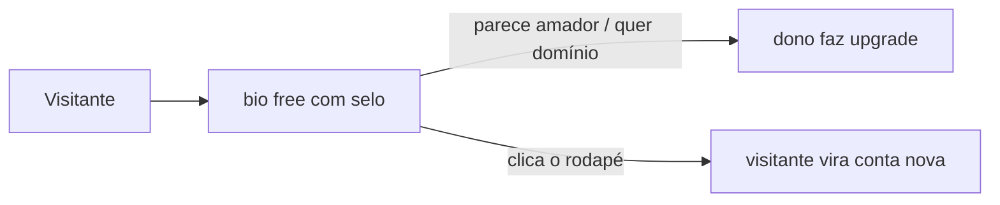
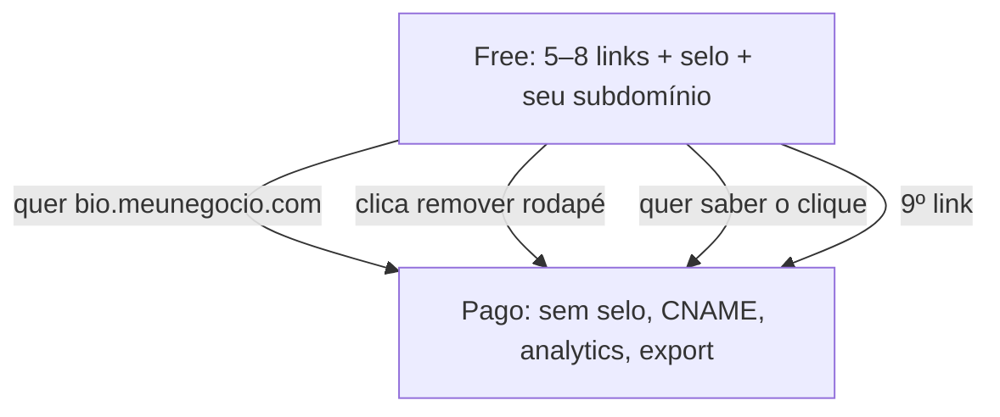

# Freemium: selo no rodapé, não marca d’água

Cabe um plano **free** — **na bio**. Não como marca d’água de banco de imagem por cima da página.

Nesta categoria o mecanismo que já converte é outro: **rodapé “Feito com X”** (clicável) + **URL no seu domínio** + **sem domínio próprio**. É o que Linktree e Carrd usam. Têm dois efeitos: o dono paga para parecer profissional; o visitante clica o selo e vira cadastro novo.

## O que sim e o que não

| Superfície | Free com selo? | Por quê |
|---|---|---|
| Bio | Sim — rodapé fino, ~12px, link para a landing | Job clássico da categoria; o próprio site é anúncio |
| Institucional / portfólio | Não | Selo numa página “empresa” humilha o cliente; você vira hosting grátis |
| Marca d’água diagonal por cima do conteúdo | Não | Visitante some; não diferencia de ferramenta tosca |

Institucional **só pago**. Selo lá só com permissão, como anúncio seu — não como paywall.

## O que de fato empurra o upgrade

Nesta ordem:

1. **Domínio próprio** (`bio.meunegocio.com`) — o paywall mais honesto da categoria.
2. Botão no editor **“remover rodapé”** → checkout. Não precisa cobrir a página.
3. **Analytics** de clique — dono de Instagram sente falta na 2ª semana.
4. O **9º link** (free para em 5–8).
5. **Export** zip Hugo — só no pago; é o diferencial, não o isca.

## Desenho que cabe em 6–10 h/semana

O free é **fino**. Senão vira cemitério de zumbis e ticket no zap.

**Free**

- só bio
- `{slug}.sites.seudominio.com`
- 5–8 links, 1 foto de perfil, 1 skin
- sem analytics, sem export, sem CNAME
- magic link, **zero WhatsApp** de suporte
- **90 dias sem publish/visita → pausa o HTML**

**Pago**

- tira o selo e o teto de links
- libera domínio próprio, analytics, export, skins
- **não** cai para R$ 12,90 só porque existe free

O free compete com Linktree / Geral / Biofy no chão. O pago vende domínio, cara limpa e export Hugo.

## Conta honesta

Conversão típica de PLG sem marca grande: **2–5%** free → pago. A uns 3%, são ~**33 contas grátis para 1 de R$ 24,90**.

O free é canal, não receita. Infra de HTML estático aguenta milhares barato; atendimento e rebuild não. Por isso o free tem de ser auto-pausável e sem atendimento humano.

## O que não fazer

- Trial 14 dias full e depois pagar ou morrer — conversão ok, distribuição zero para quem ainda não te conhece.
- Free institucional de 4 páginas com selo.
- Forever-free ilimitado com build Hugo a cada save.
- Cobrar para “tirar a marca” e ainda deixar o dono só no seu subdomínio — ele quer o domínio **dele**.
- Atender free no WhatsApp.

## Checklist

- [ ] Selo só no free da bio, uma linha no rodapé
- [ ] Sem marca d’água por cima do conteúdo
- [ ] Domínio próprio, analytics e export só no pago
- [ ] 5–8 links no free; o seguinte é paywall
- [ ] 90 dias inativo → HTML pausado
- [ ] Institucional só pago; selo opcional com permissão
- [ ] Preço pago não desce para a faixa Biofy R$ 12,90–16,90
