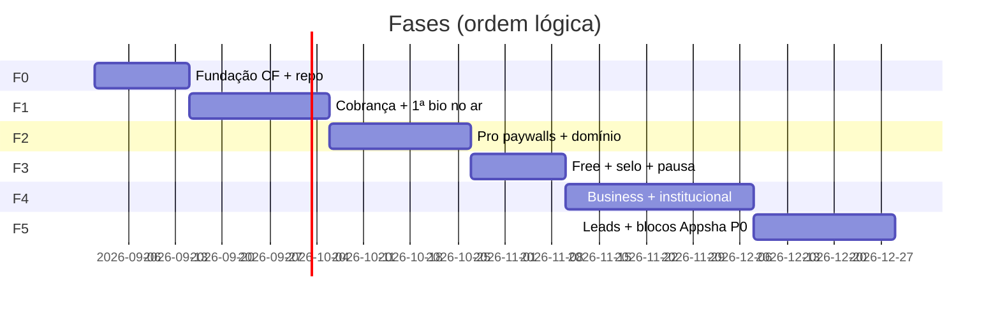

# Plano de construção

Marcos por **receita** e **risco**, não por stack. Cloudflare é premissa; resto evolui.

## F0 — Fundação (semana 1–2)

**Objetivo:** deployável; zero cliente ainda.

| Entrega | Casos de uso |
|---|---|
| Zona CF + DNS `www` / `app` / `*.sites` | UC-01 |
| Terraform plataforma (R2, KV, Queue, SQL) | — |
| Workers esqueleto + health | — |
| Schema: `users`, `tenants`, `subscriptions`, `page_models` | UC-06+ |
| CI: lint, test, deploy app | — |

**Não fazer:** editor bonito, free, CRM.

## F1 — Primeiro real (semana 3–5)

**Objetivo:** **primeiro real de MRR** — alguém paga e publica.

| Entrega | Casos de uso |
|---|---|
| Landing + checkout PSP | UC-01, UC-13–UC-16 |
| Webhook → user + tenant + magic link | UC-14, UC-17 |
| Onboard 4 passos + slug | UC-23–UC-27 |
| Editor mínimo (links + WhatsApp + avatar) | UC-29–UC-32 |
| Publish assíncrono → R2 | UC-41–UC-44 |
| Site público 200 + selo off (só pago) | UC-47–UC-49 |
| **Plano Pro único** no ar | UC-13 |

**Gate de saída:** 1 cliente pagante publicou bio em `{slug}.sites…`.

## F2 — Pro que retém (semana 6–8)

**Objetivo:** paywalls que **justificam renovação**.

| Entrega | Casos de uso |
|---|---|
| Custom Hostname (domínio cliente) | UC-56–UC-59 |
| Analytics clique (Analytics Engine) | UC-61–UC-63 |
| QR no dashboard | UC-64 |
| Inadimplência 3–7d + página pausada | UC-19–UC-21 |
| Export do site (zip) | UC-45 |
| Temas/skins extra Pro | UC-33 |

**Gate:** cliente Pro no domínio próprio + analytics visto no dashboard.

## F3 — Free como canal (semana 9–10)

**Objetivo:** aquisição sem matar margem.

| Entrega | Casos de uso |
|---|---|
| Signup free (sem PSP) | UC-76–UC-78 |
| Selo rodapé + limite links | UC-79 |
| Cron pausa 90d | UC-80 |
| Upgrade in-app → checkout | UC-66–UC-68 |

**Gate:** free publica bio; upgrade Pro funciona; pausa automática testada.

## F4 — Business / ARPU (semana 11–14)

**Objetivo:** **ticket maior** — institucional e multi-página.

| Entrega | Casos de uso |
|---|---|
| Plano Business + checkout | UC-13 |
| Starters institucional/portfólio | UC-34–UC-35 |
| Multi-página no page-model | UC-36 |
| SEO pack (title/OG/canonical) | UC-37 |
| 2º site na mesma conta (add-on ou Business) | UC-86–UC-87 |

**Gate:** 1 cliente Business com site 3+ páginas no ar.

## F5 — Ação na página (semana 15–17)

**Objetivo:** diferencial vs link-in-bio commodity; upsell.

| Entrega | Casos de uso |
|---|---|
| Embeds (YT, Maps, Spotify) | UC-38 |
| Highlights + galeria | UC-39–UC-40 |
| Form → e-mail do dono (Business) | UC-81–UC-83 |
| Bloco agendado (starts/ends) | UC-84 |
| Card afiliado / loja externa | UC-85 |

**Gate:** form gera lead no e-mail; bloco expira sozinho.

## F6 — Escala (backlog pós-PMF)

- Agency: multi-perfil + seats (UC-88–UC-90)
- Embed Calendly nativo
- Download gated PDF
- Reviews embed (Google)
- White-label selo removido Agency

## Stack recomendada v1 (não contrato)

| Peça | Sugestão v1 | Pode trocar |
|---|---|---|
| App API + dashboard | Worker + framework SPA | Qualquer host CF |
| SQL | D1 ou Postgres+Hyperdrive | Sim |
| Publish | Queue + Worker/Container render templates | Hugo, React-email-style, MD |
| E-mail | Resend | Sim |
| PSP BR | Stripe BR ou Asaas | Sim |
| IaC plataforma | Terraform | Pulumi, manual |

## Riscos e mitigação

| Risco | Mitigação |
|---|---|
| Free vira custo | Pausa 90d; sem suporte humano |
| Publish lento | Fila + 202; nunca sync no botão |
| Churn pós-mês 1 | Domínio + analytics cedo (F2) |
| Lock-in Hugo | Page-model + renderer interface |
| PSP BR PIX recorrente | Asaas/MP mesmo webhook pattern |

## Definition of Done (produto)

- [ ] UC-01 a UC-49 implementados (F1–F2)
- [ ] MRR &gt; 0 com cliente real
- [ ] Churn e upgrade medidos
- [ ] Runbook: webhook falhou, publish falhou, domínio pendente

Especificação completa: **[casos-de-uso.md](casos-de-uso.md)**.
