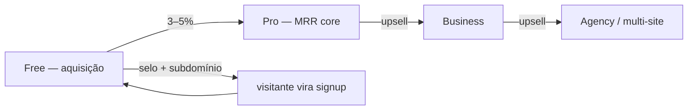
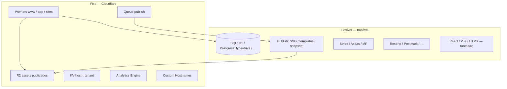

# Produto e receita recorrente

**North star:** MRR. Tudo que não aumenta assinatura, retenção ou upgrade é backlog ou descarte.

**Única trava de infra:** [Cloudflare](cloudflare-infra.md) (Workers, R2, edge, Custom Hostnames).  
**Sem trava de stack:** banco, linguagem do app, motor de publicação, PSP, e-mail — escolha por custo e velocidade, não por dogma.

## O que vendemos

Perfil digital que **vira receita pro cliente** (WhatsApp, link, formulário, booking embed) e **vira assinatura pra gente** (domínio, analytics, páginas a mais, sem selo, captura de leads).

| Camada | Job | Recorrência |
|---|---|---|
| **Página pública** | Bio + institucional/portfólio no ar, rápido, mobile | Cliente paga mensal |
| **Editor** | Blocos, preview, publicar em 1 clique | Retenção |
| **Monetização nossa** | Planos + limites + paywalls no momento certo | MRR |
| **Pós-clique (fase 2+)** | Form → lead, embed Calendly, cards de oferta | Upgrade Pro → Business |

Não somos CRM enterprise nem social suite. **Somos** “presença profissional + ação + dados mínimos que justificam pagar todo mês”.

## Modelo de receita

### Planos (BRL, orientativo)

| Plano | Preço/mês | Para quem | O que trava receita |
|---|---|---|---|
| **Free** | R$ 0 | Testar, IG pequeno | Selo, subdomínio, 5–8 links, sem domínio/analytics/export |
| **Pro** | R$ 29–39 | MEI, creator, consultor | Sem selo, domínio, analytics, embeds/galeria/QR, links ilimitados |
| **Business** | R$ 59–79 | Clínica, estúdio, PME | Institucional multi-página, form→lead, SEO pack, 2 sites |
| **Agency** | R$ 99+ | Agência / multi-marca | N perfis, seats, white-label opcional |

**Regras de ouro**

1. **Cartão/PIX recorrente no signup pago** — webhook cria conta; PSP é porteiro ([signup-e-psp.md](signup-e-psp.md)).
2. **Domínio próprio no Pro** — paywall #1 (status profissional).
3. **Analytics no Pro** — paywall #2; spec **[analytics.md](analytics.md)**.
4. **Institucional só Business+** — ARPU sobe; free não vira hosting grátis de 4 páginas.
5. **Form/leads no Business+** — diferencial vs Linktree; não precisa CRM pesado no v1.
6. **Free auto-pausável** (90d) — custo marginal ~zero; não virar suporte humano.

Trial 14d full: **opcional no Pro**, não no free forever. Free forever = canal; Pro = receita.

## Arquitetura: fixo vs flexível

| Decisão | Fixo | Flexível |
|---|---|---|
| Onde roda | Cloudflare Workers + R2 | — |
| Onde persiste tenant | — | Qualquer SQL gerenciado |
| Como gera HTML | — | Pipeline assíncrono (Hugo hoje, outro amanhã) |
| Como deploya infra | Terraform plataforma | CI do app (Wrangler, GitHub Actions, …) |
| Cookie de sessão | Só `app.` | Implementação livre |

**Contrato imutável:** tenant = registro no banco + prefixo `sites/{id}/` no R2; visitante resolvido por **Host**, nunca por path.

## O que saiu das travas antigas

| Trava removida | Substituído por |
|---|---|
| “Só Hugo” | **Publish pipeline** plugável; export zip = artefato do pipeline |
| “Só D1” | SQL gerenciado; Hyperdrive se precisar Postgres |
| “6–10 h/semana” | Fases de construção com marcos de **receita**, não de horas |
| “Nunca CRM” | **Captura de leads leve** no Business (lista + e-mail), não Salesforce |
| “Custom domain v2” | **Pro** desde fase 2 se converter |
| “1 site para sempre” | Multi-site = plano Agency / add-on |
| “Anti-Appsha total” | Copiar blocos que **aumentam MRR** (QR, form, highlights) |

## Métricas que importam

| Métrica | Alvo inicial |
|---|---|
| MRR | Crescer m/m |
| Free → Pro | 3–5% |
| Churn mensal Pro | &lt; 5% |
| Time-to-first-publish | &lt; 15 min pós-pagamento |
| Sites pausados (free) | &gt; 70% inativos ok |
| CAC payback | &lt; 3 meses |

## Docs relacionados

- [casos-de-uso.md](casos-de-uso.md) — especificação para construir
- [plano-construcao.md](plano-construcao.md) — fases e entregas
- [tenants-e-dominios.md](tenants-e-dominios.md) — três origens, tenant, DNS
- [freemium.md](freemium.md) — free como canal de MRR
