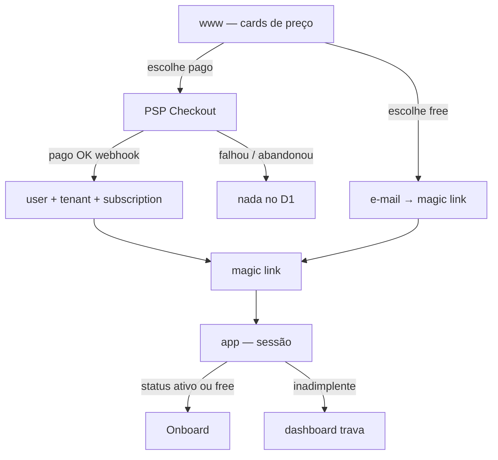
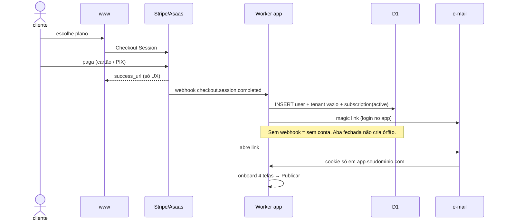
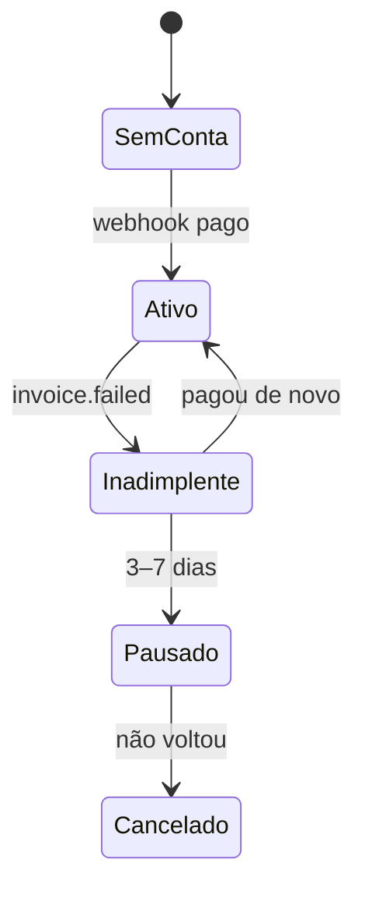

# Signup e PSP como porteiro

No plano **pago**, o gateway (Stripe / Asaas / Mercado Pago) é o fiscal: conta e magic link só nascem no **webhook de pagamento confirmado**. O app não inventa acesso.

Não consulte o PSP em todo request. O webhook grava `subscription.status` no D1; o app lê isso.

## Signup pago (PSP = fiscal)

1. **Landing** — card de preço; ainda sem conta.
2. **Checkout no PSP** — Stripe/Asaas. Você não guarda cartão.
3. **`success_url`** — “obrigado / abra o e-mail”. **Não** cria user.
4. **Webhook** (`checkout.session.completed` ou equivalente) — única fonte de verdade:
   - cria `user` + `tenant` vazio + `subscription` (`customer_id`, `status=active`, `plan`)
   - dispara magic link
5. **Magic link** — sessão no `app`. Sem senha no dia 1.
6. **Onboard** — slug → starter → conteúdo → Publicar (fila Hugo).
7. **Site no ar** — `{slug}.sites…`. Domínio próprio só depois, se pago.

No pagamento **não** criar site, subdomínio nem Custom Hostname — isso é o onboard.

## Quem tem acesso (depois do signup)

| Evento do PSP | O que o app faz |
|---|---|
| `active` / pago | Dashboard + publish liberados |
| Cobrança falhou | Dashboard trava; site público espera 3–7 dias |
| Não voltou | Site vira “pausado” no **mesmo** host |
| Cancelou | Export zip; drop em 30 dias |

O Worker `app` checa `subscription.status` no D1 em toda ação sensível (salvar, publicar, CNAME). O Worker `sites` só lê `paused`/`active` no KV — não fala com o Stripe.

## Signup free (se mantiver freemium)

Porta **sem** PSP:

1. Landing → “começar grátis” → e-mail
2. Magic link → tenant `plan=free`
3. Mesmo onboard, teto 5–8 links + selo
4. Upgrade = Checkout do PSP → webhook promove `plan` e tira selo

Aqui o PSP **não** é o fiscal da porta de entrada; é o fiscal do **upgrade**.

## Regra curta

| Pergunta | Resposta |
|---|---|
| Posso usar o gateway como fiscal? | **Sim**, no pago: webhook = nasce conta; status = continua acesso |
| Cadastro sem pagar? | Só se existir free; senão, só Checkout |
| Quem cria a conta? | **Webhook**, nunca o `success_url` |
| O site público depende do PSP a cada visita? | **Não** — D1/KV com status sincronizado |

Se for **só pago** (sem free): sem webhook → sem magic link → sem app.
