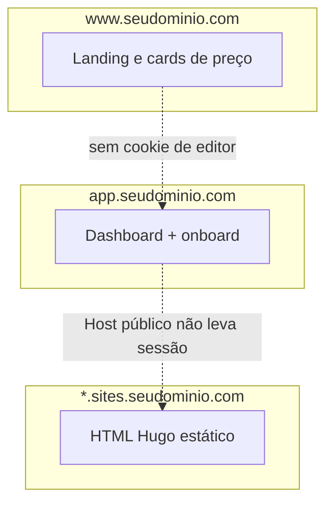
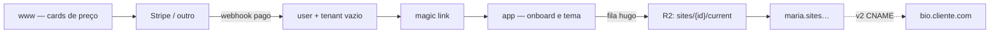
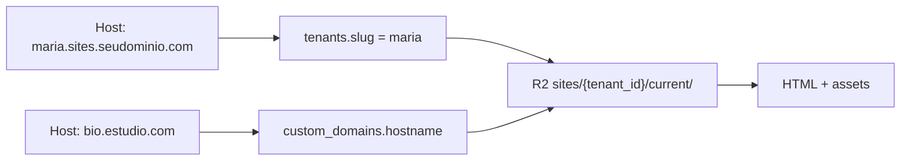
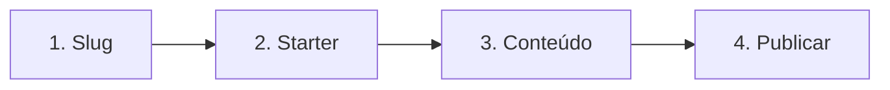
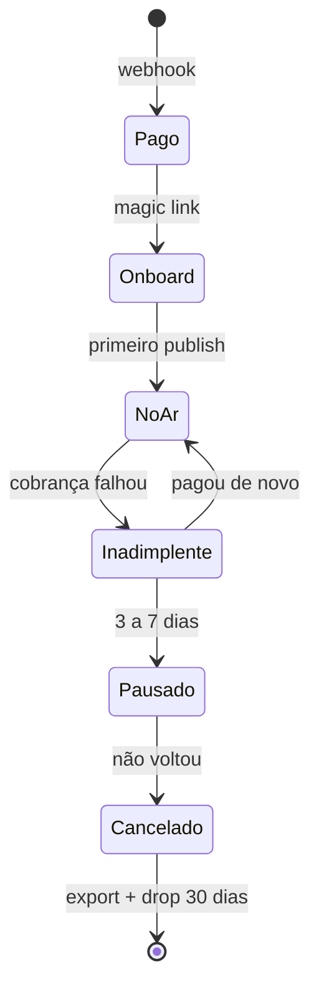

# Tenants, DNS e onboarding

O fluxo landing → preço → pagamento → dashboard → tema → deploy **é o fluxo certo** para a bio. Tenant **não** é uma máquina por cliente: é uma linha no banco + uma pasta de HTML no CDN, escolhida pelo **Host**.

## Três origens (nunca misturar)

| Superfície | Host | Função |
|---|---|---|
| Marketing | `www.seudominio.com` | Landing e cards de preço. Sem sessão. |
| App | `app.seudominio.com` | Dashboard, onboarding, cobrança. Cookie só aqui. |
| Sites | `{slug}.sites.seudominio.com` | HTML Hugo publicado. Sem cookie de login. |

O domínio do cliente (`bio.estudio.com`) entra **depois**, no v2: CNAME para o mesmo origin de `sites` + certificado automático (Cloudflare for SaaS). Não é um site na Hostinger por assinante.

## Fluxo de signup até o ar

1. Cliente escolhe o plano na landing.
2. PSP (Stripe ou equivalente) cobra.
3. **Webhook** cria `user` + tenant vazio + assinatura e dispara o link de acesso.
4. Magic link abre `app.seudominio.com` (não a página pública).
5. Onboard simples → escolhe tema/starter → **Publicar**.
6. O job Hugo grava `current/` e o host `{slug}.sites…` passa a responder 200.

A `success_url` só redireciona. Quem cria a conta é o **webhook** (`checkout.session.completed` ou equivalente). Aba fechada e PIX atrasado não podem deixar tenant órfão.

## Como o tenant é distribuído

Um Postgres, um bucket, um worker. Isolamento = `tenant_id` em toda linha e prefixo `sites/{uuid}/`.

O visitante nunca vê o UUID: o CDN lê o `Host`, acha o slug (ou o hostname customizado) e serve `current/`.

- **Tema:** um repo pinado por versão, não clone por cliente.
- **Publish:** fila. O request HTTP do botão não chama o `hugo`.
- **Publish atômico:** só depois do build OK o ponteiro `current` muda; se falhar, o site antigo continua.

Path (`sites.seudominio.com/maria`) só serve se **nunca** houver CNAME de cliente. CNAME aponta para um **host**, não para um path.

### O que não é distribuição de tenant

- 1 VPS por cliente
- 1 site Hostinger por assinante
- 1 namespace Kubernetes por tenant
- Pasta FTP visível por cliente no mesmo hosting
- `app.{slug}` servindo o dashboard **e** a página pública
- Cookie de sessão em `.sites.seudominio.com`

## Pagamento

Stripe serve. No BR, pela doc atual:

- **Pix avulso:** conta Stripe brasileira aceita, liquidação em BRL.
- **Pix Automático** (mensalidade): existe no produto Stripe, mas conta BR ainda aparece como *invite only*. Cartão passa.
- Se o Dashboard não liberar PIX recorrente, o plano B é Asaas / Mercado Pago com o **mesmo** desenho: checkout → webhook → magic link.
- Conta Stripe **fora** do BR cobrando brasileiro ainda leva **IOF 3,5%** (default no pagador).

O app não conhece o PSP além de `customer_id` + status da assinatura.

No pagamento **não** criar site publicado, subdomínio nem Custom Hostname. Isso é o onboard.

O link de acesso é **login no app** (magic link no e-mail; WhatsApp opcional). MEI esquece senha; não há tempo de resetar no dia 1.

## Onboard (quatro telas, depois do dinheiro)

1. **Slug** — `maria` vira `maria.sites.seudominio.com`. Bloquear reservados (`www`, `app`, `sites`, `api`) e ofensivos. Imutável no MVP (trocar slug quebra SEO e CNAME).
2. **Starter** — `bio-oferta` | `bio-lista` | `inst-saude-local` | `port-studio`. Preenche o page-model; não desenha tema novo.
3. **Conteúdo** — nome, uma frase, WhatsApp, 3–8 links **ou** as 4 páginas do institucional.
4. **Publicar** — job Hugo → `current` → 200 em `https://{slug}.sites.seudominio.com`.

Domínio próprio fica em **Configurações**, depois do primeiro ar. Apex (`cliente.com` no `@`) é o passo chato; no MVP aceite `bio.` ou `www`.

Uma conta = um site no começo. Bio e institucional são o mesmo motor (`kind` no page-model), não segunda infra.

## Canonical e SEO

`baseURL` e `canonical` no Hugo = a URL que o visitante deve indexar (domínio próprio se ativo; senão o subdomínio `sites`). **Nunca** `app.seudominio.com`.

## Ciclo de vida da assinatura

- Trial sem cartão: evitar no dia 1 (conta zumbi e suporte).
- Inadimplente: dashboard trava; o site público espera **3–7 dias** e vira “assinatura pausada” **no mesmo host**. Não apague o HTML no dia da fatura (SEO e o WhatsApp do cliente).
- Cancelou: export zip Hugo; depois 30 dias drop.

## MVP de uma pessoa (6–10 h/semana)

- 1 API (app) + 1 worker Hugo (mesmo VPS / Fly / Railway no começo)
- Postgres gerenciado
- R2/S3 + Cloudflare na frente de `sites`
- Certificado curinga `*.sites.seudominio.com`
- Checkout do PSP

Deixar para depois:

- Custom Hostname (Cloudflare for SaaS) — quando o 1º cliente pedir domínio
- Segundo plano “2 sites”
- Preview iframe Hugo em todo keystroke

## Checklist do que não misturar

- [ ] Cookie de app não em `.sites.seudominio.com`
- [ ] API autenticada não no host público
- [ ] Token Hostinger do cliente não existe neste desenho
- [ ] Publicar não espera o request HTTP do botão (fila)

---

*Nota de produto. Stripe Pix: [docs.stripe.com/payments/pix](https://docs.stripe.com/payments/pix). Cloudflare for SaaS: [Custom Hostnames](https://developers.cloudflare.com/cloudflare-for-platforms/cloudflare-for-saas/start/getting-started/).*
